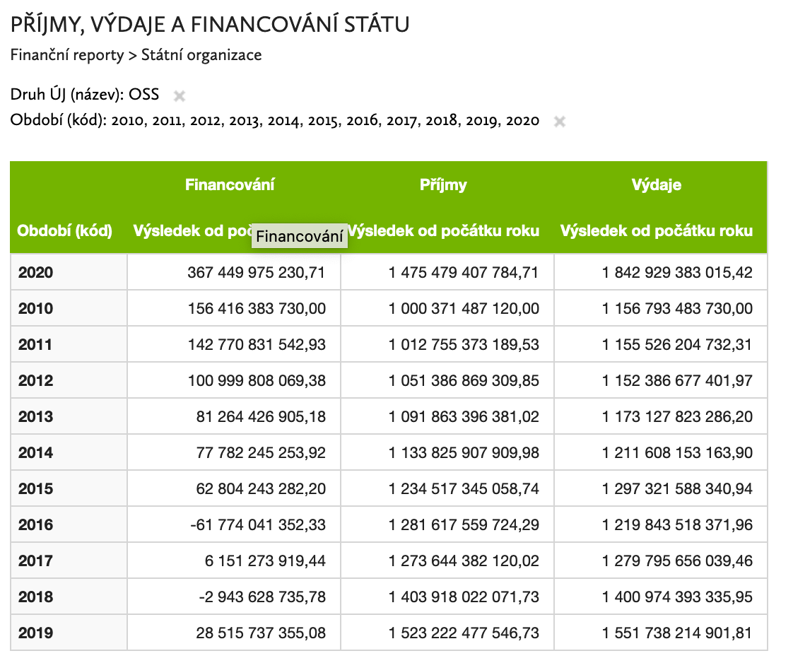

```{r setup, include=FALSE}
knitr::opts_chunk$set(echo = TRUE)
source("_packages.R")
```

```{r}
targets::tar_load(sp_cl)
targets::tar_load(sp_central_new_arrdir)
targets::tar_load(sp_central_old_arrdir)
targets::tar_load(sp_local_arrdir)
```


```{r}
ico_oss <- sp_cl$ucjed %>% filter(druhuj_id == "1") %>% pull(ico) %>% unique()
```


```{r}
plot(mtcars)
```

https://monitor.statnipokladna.cz/analyza/##query=uq_247a15da-aad1-4ddb-889d-6b8b76dd4a61



```{r}
bind_rows(
  open_dataset(sp_central_old_arrdir) %>% 
    filter(ico %in% ico_oss) %>%
    select(per_yr, druh, budget_spending) %>% 
    collect() %>% 
    count(per_yr, druh, wt = budget_spending/1e9) %>% 
    spread(druh, n),
  open_dataset(sp_central_new_arrdir) %>% 
    filter(ico %in% ico_oss) %>%
    select(per_yr, druh, budget_spending) %>% 
    collect() %>% 
    count(per_yr, druh, wt = budget_spending/1e9) %>% 
    spread(druh, n)
)
```
https://monitor.statnipokladna.cz/analyza/##query=uq_5fb642ff-31a3-4640-9d29-2fbdb2d0bb72

```{r}
open_dataset(sp_local_arrdir) %>% 
  # filter(ico %in% ico_oss) %>%
  select(per_yr, druh, budget_spending, kraj) %>% 
  collect() %>% 
  # filter(per_yr == 2020) %>% 
  count(per_yr, druh, wt = budget_spending/1e9) %>% 
  spread(druh, n) 
  # arrange(`Příjmy`)
```
```{r}
lgs <- open_dataset(targets::tar_read(sp_local_grants_arrdir))

lgs %>% 
  filter(per_yr == 2020) %>% 
  select(ucelznak_ucelznak_nazev, budget_grants) %>% 
  collect() %>% 
  count(ucelznak_ucelznak_nazev, wt = budget_grants/1e9, sort = T) %>% 
  head()
```

