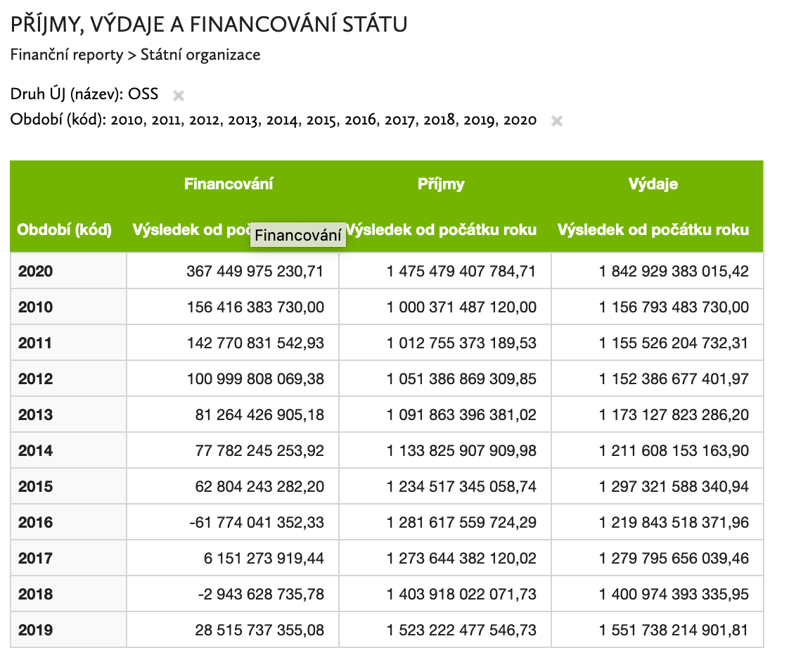

```{r setup, include=FALSE}
knitr::opts_chunk$set(echo = FALSE, warning = FALSE, message = FALSE)
source("_targets_packages.R")
```

```{r load-targets}
targets::tar_load(sp_cl)
targets::tar_load(sp_central_new_arrdir)
targets::tar_load(sp_central_old_arrdir)
targets::tar_load(sp_local_arrdir)
targets::tar_load(efs_fin)
targets::tar_load(efs_obl)
targets::tar_load(efs_zop)
targets::tar_load(efs_prj)
targets::tar_load(efs_prj_basic)
targets::tar_load(efs_prj_kat)
targets::tar_load(efs_prj_sc)
targets::tar_load(sp_central_new_ops)
```

# Vstupní kontrola dat {.tabset}

```{r ico-oss}
ico_oss <- sp_cl$sp_cl_aa7d5f37_ucjed %>% 
  filter(druhuj_id == "1") %>% pull(ico) %>% unique()
```

## Rozpočty

https://monitor.statnipokladna.cz/analyza/##query=uq_247a15da-aad1-4ddb-889d-6b8b76dd4a61

### Příjmy a výdaje centrální

Podle Monitoru:



Z dat:

```{r budget-basic}
bind_rows(
  open_dataset(sp_central_old_arrdir) %>% 
    filter(ico %in% ico_oss) %>%
    select(per_yr, druh, budget_spending) %>% 
    collect() %>% 
    count(per_yr, druh, wt = budget_spending/1e9) %>% 
    spread(druh, n),
  open_dataset(sp_central_new_arrdir) %>% 
    filter(ico %in% ico_oss) %>%
    select(per_yr, druh, budget_spending) %>% 
    collect() %>% 
    count(per_yr, druh, wt = budget_spending/1e9) %>% 
    spread(druh, n)
)
```

#### OP v tom

```{r budget-ops}
sp_central_new_ops %>% 
  filter(!is.na(op_nazev)) %>% 
  filter(!(nastroj_id == "110" & nastrojanal_id != "11001")) %>% # vyhodit přeshraničku kromě ČR-PL pro srovnatelnost
  # count(nastroj_id, op_nazev, wt = budget_spending/1e9, sort = T)
  count(wt = budget_spending/1e9, sort = T)
```


```{r budgets-groups}
sp_central_new_ops %>% 
  filter(!is.na(op_nazev)) %>% 
  filter(!(nastroj_id == "110" & nastrojanal_id != "11001")) %>% # vyhodit přeshraničku kromě ČR-PL pro srovnatelnost
  count(seskupeni, podseskupeni, wt = budget_spending/1e9)
```


```{r budgets-nastroje}
sp_central_new_ops %>% 
  filter(str_detect(nastroj_nazev, "2014+")) %>% 
  count(nastroj_id, nastroj_nazev, wt = budget_spending/1e9, sort = T)
```


```{r}
sp_central_new_ops %>% 
  filter(str_detect(zdroj_nazev, "2014+")) %>% 
  count(nastroj_id, nastroj_nazev, zdroj, zdroj_nazev,
        wt = round(budget_spending/1e9, 2), sort = T)
```


### Příjmy a výdaje samospráv 

https://monitor.statnipokladna.cz/analyza/##query=uq_5fb642ff-31a3-4640-9d29-2fbdb2d0bb72


```{r}
open_dataset(sp_local_arrdir) %>% 
  # filter(ico %in% ico_oss) %>%
  select(per_yr, druh, budget_spending, kraj) %>% 
  collect() %>% 
  # filter(per_yr == 2020) %>% 
  count(per_yr, druh, wt = budget_spending/1e9) %>% 
  spread(druh, n) 
  # arrange(`Příjmy`)
```

### Lokální přijaté od státu

```{r}
lgs <- open_dataset(targets::tar_read(sp_local_grants_arrdir))

lgs %>% 
  filter(per_yr == 2020) %>% 
  select(ucelznak_nazev, budget_grants) %>% 
  collect() %>% 
  count(ucelznak_nazev, wt = budget_grants/1e9, sort = T) %>% 
  head()
```


